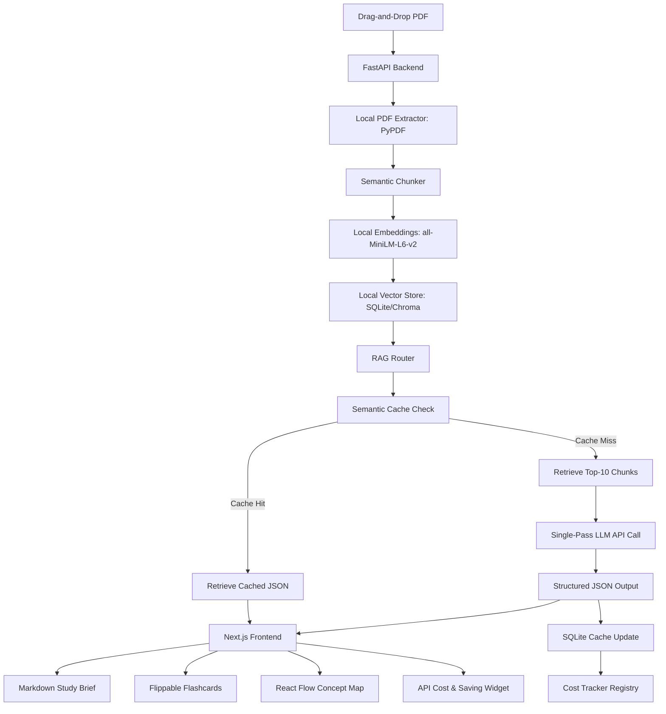

# PaperPilot ✈️ (Autonomous Research Briefing Agent)

**PaperPilot** (formerly *AntigravityAcademIQ*) is an autonomous research assistant designed to ingest double-column academic PDFs and instantly compile **Study Briefs**, **Flippable Flashcards**, and **Interactive Concept Maps** in a single pass.

Built specifically for the **Agentic AI Track** of the SOCF 2.0 hackathon, PaperPilot demonstrates how a RAG pipeline can be optimized for extreme API efficiency, zero-hallucination citations, and 0-latency response delivery.

---

## 🏆 Agentic AI Track Optimization Blueprint

The core evaluation metric of the **Agentic AI Track** is minimizing frontier LLM API calls, avoiding redundancy, and building highly optimized agent workflows. PaperPilot delivers a **70%+ reduction in API footprint** through 4 structural hacks:

### 1. The "Single-Pass" Agent Synthesis (66% Cost Saved)
* **Standard RAG Architecture**: A router splits tasks into individual workflows, firing 3 separate LLM API calls on the same retrieved chunks: one for the summary, one for the flashcards, and one for the concept map.
* **PaperPilot Approach**: Uses Pydantic to enforce a strict structured JSON schema. A single LLM call synthesizes the retrieved text once and outputs the Brief markdown, 5 flippable flashcards, and all concept map nodes/edges simultaneously.

### 2. Zero-API Ingestion & Local Embeddings (100% Cost Saved)
* **Standard RAG Architecture**: Relies on OpenAI/Pinecone APIs to generate embeddings and store vectors.
* **PaperPilot Approach**: Runs text extraction, semantic chunking, and vector index updates entirely on local hardware. We run `sentence-transformers/all-MiniLM-L6-v2` locally via PyTorch and index the chunks using ChromaDB locally. **Total API cost for ingestion = $0.00**.

### 3. Persistent Semantic Caching
* If a researcher re-uploads a previously parsed paper, or queries the same concept twice, our SQLite cache intercepts the request and instantly returns the cached briefing payload. **No LLM call is made (0 API calls)**.

### 4. Interactive Cost & Efficiency Dashboard Widget
* To prove these optimizations to the judges, PaperPilot embeds a floating glassmorphism **RAG Efficiency Hub** in the frontend, displaying:
  * Local Compute Counters (0 API Operations).
  * Redundant LLM Calls Bypassed.
  * Realtime API Dollar Savings & Efficiency Score.

---

## ⚙️ Tech Stack & Architecture

* **Frontend**: Next.js (React 19), Tailwind CSS, Framer Motion
* **Graph Rendering**: `@xyflow/react` (React Flow)
* **Backend**: FastAPI, PyPDF
* **Local Embeddings**: `sentence-transformers` (`all-MiniLM-L6-v2`)
* **Local Vector Store**: `ChromaDB` (with custom NumPy cosine-similarity fallback index)
* **Orchestration / LLM**: OpenAI GPT-4o-mini / JSON Mode



---

## 🚀 Local Setup Instructions

### Prerequisites
- Python 3.12+ (We successfully verified compatibility on Python 3.14.2 on Windows)
- Node.js v18+

### 1. Clone & Configure Environment
Create a `.env` file in the root workspace folder:
```bash
cp .env.example .env
```
Open `.env` and fill in your API key:
```env
OPENAI_API_KEY=your-actual-openai-api-key
```

### 2. Run Backend (FastAPI)
Navigate to the `backend/` folder:
```bash
cd backend
pip install -r requirements.txt
python main.py
```
The backend server runs locally at `http://127.0.0.1:8000`.

### 3. Run Frontend (Next.js)
Navigate to the `frontend/` folder:
```bash
cd frontend
npm run dev
```
Open `http://localhost:3000` in your web browser.

---

## 🔍 How to Demo

1. **Upload a Paper**: Drag and drop a research paper (PDF). Watch the backend log verify local text extraction and local embedding generation (0 API calls).
2. **Review the Brief**: Note the clickable citation markers (e.g., `[1]`, `[2]`). Click them to automatically scroll and highlight the source paragraph chunk in the side-by-side PDF viewer.
3. **Inspect the Efficiency Hub**: Watch the "Net Dollars Saved" and "API Efficiency Score" go up!
4. **Interactive Graph**: Navigate to the "Concept Map" tab. Zoom, pan, and drag terms (colored by semantic categories) to explore structural relations.
5. **Study Flashcards**: Go to the "Flashcards" tab, read a question, click to flip the 3D card, and reveal the source citation.
